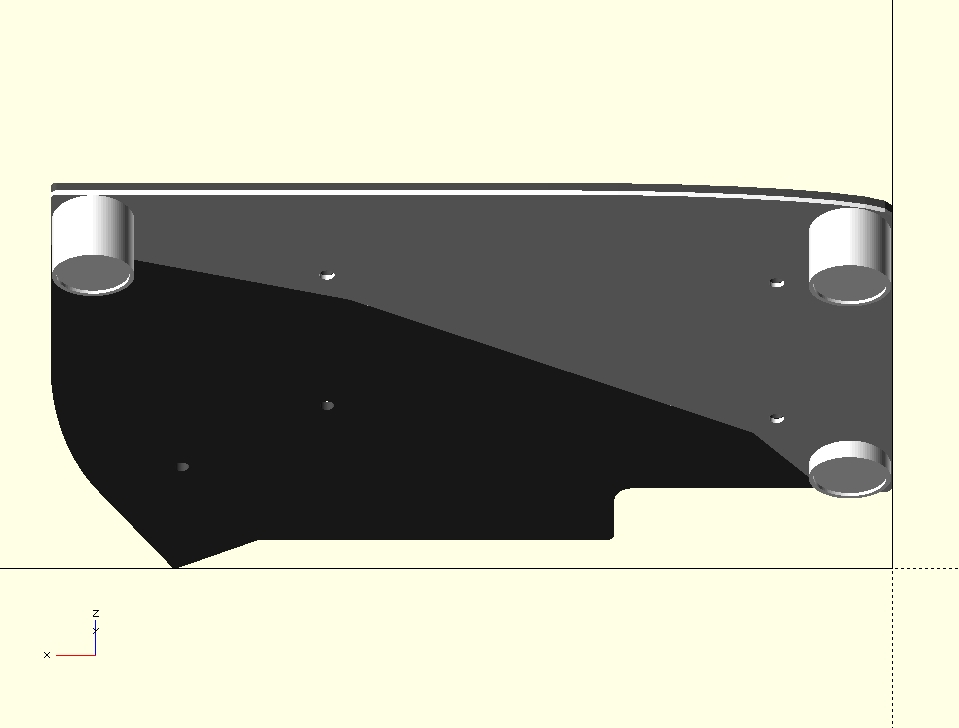

# Lily58 Base

Simple base for the [Lily58 keyboard](https://github.com/kata0510/Lily58).

## Images

*The PCB is added for reference but it's not part of the model*

## Notes

- To print both sides mirror the model in the slicer.
- [bottom-pcb.svg](bottom-pcb.svg) was exported from the [PCB kicad files](https://github.com/kata0510/Lily58/tree/master/Pro/PCB).